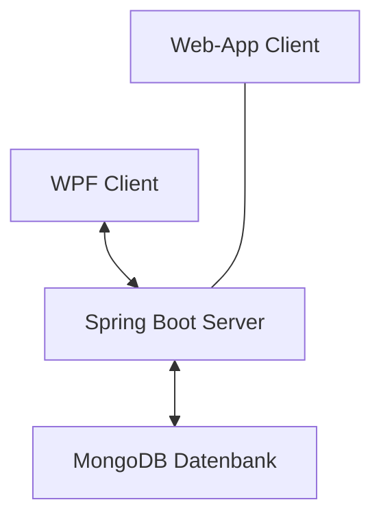
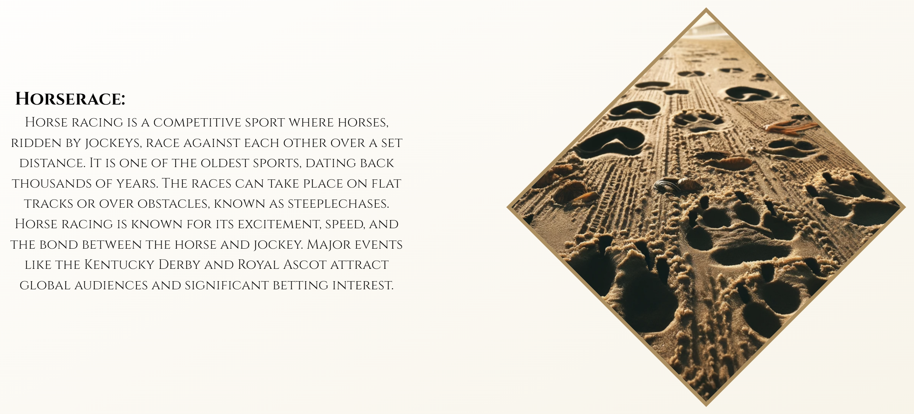
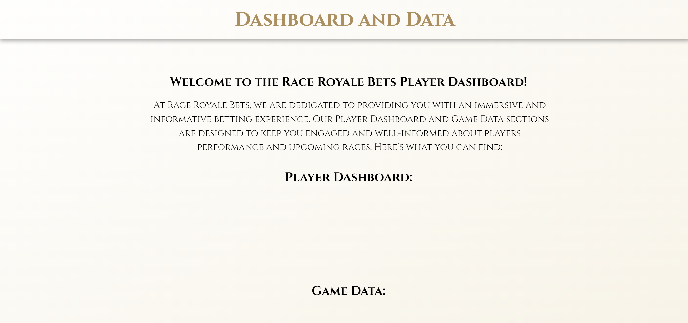
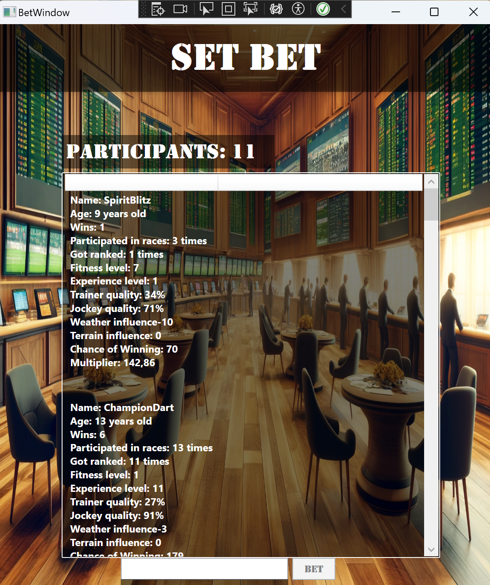
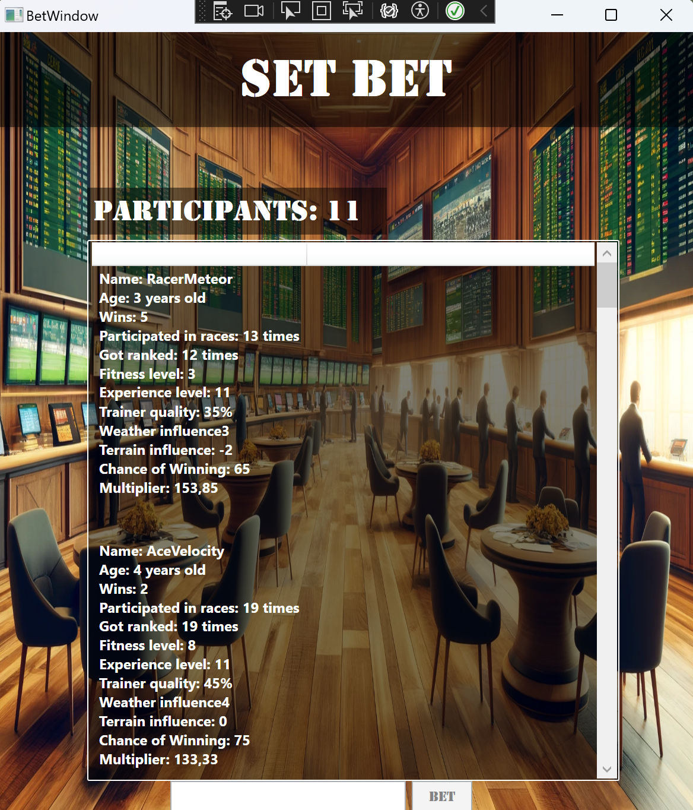
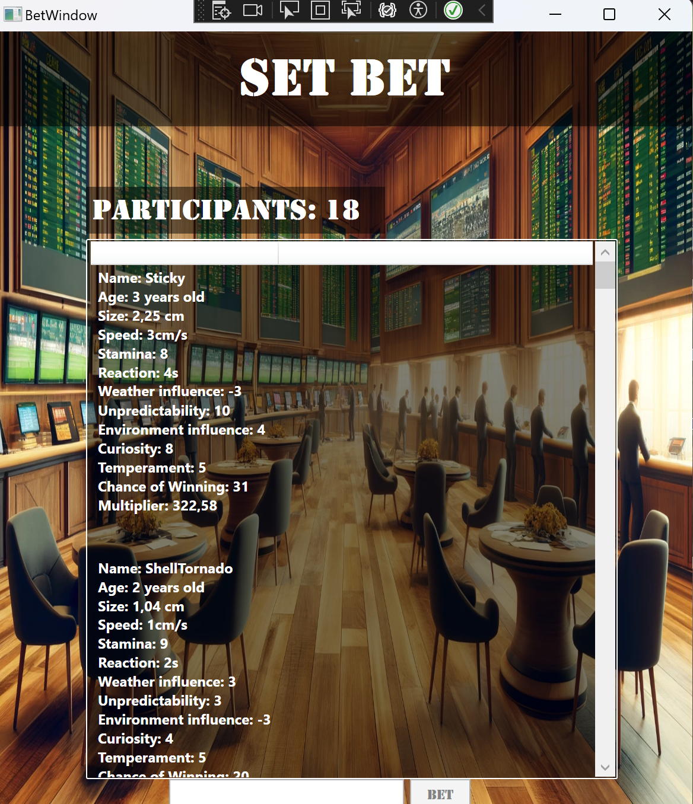
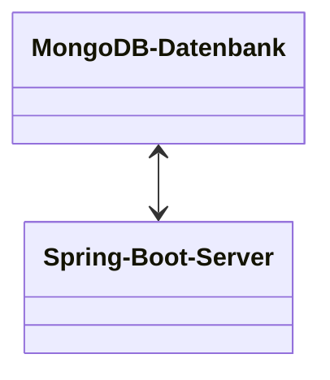
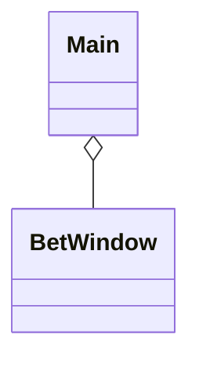
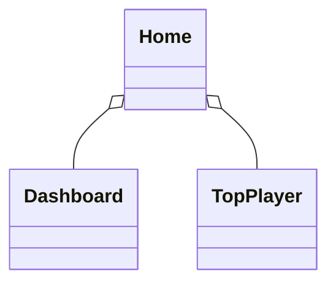
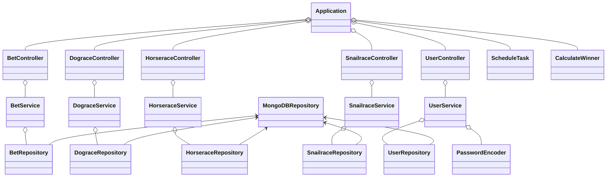

# Dokumentation Semesterprojekt Poguter

## Softwaredesign (Architektur)
Das Wettbuero wurde in einer Client-Client-Server-Architektur entwickelt, wobei der Client, also das Wettbuero selbst, als WPF-Anwendung und die Informationen und Erklaerungen zum Spiel und Ablauf, als WebApp implementiert sind. Die beiden Client-Anwendungen kommunizieren mit dem Server, welcher auf Springboot basiert. Zusaetzlich werden alle Daten bezueglich des Spiels in einer MongoDB-Datenbank gespeichert.



## Beschreibung der Software
Das Programm, welches den Namen "Race Royale Bets" traegt, ist ein Wettbuero. Besonders hierbei ist, dass in diesem Wettbuero auf drei verschiedene Renntypen gewettet werden kann. Um dabei zu sein, muss man sich zu aller erst registrieren. Falls ein Account bereits vorhanden ist, kann sich der Nutzer normal anmelden. Durch einen algorithmus, stehen immer fuenf zufaellig generierte Rennen zur verfuegung. 

Die WebApp hat die Funktion, alle Renntypen zu erklaeren und einen Ueberblick ueber den Ablauf des Spiels zu schaffen. Natuerlich wird auch ein Dashboard, welches die Top fuenf besten Spieler auflistet, angezeigt. Genauso wie auch die neuesten fuenf kommenden Rennen. 

## Funktionen der WebApp

### Animation
<br>
Das Quadrat, welches mit den Spitzen nach oben und unten zeigt, enthaelt die Erklaerung fuer die verschiedenen Renntypen, deshalb gibt es drei verschiedene. Nach dem **druecken** wird die **Animation** gestartet.<br>
<br>
So sieht es nach der **Animation** aus. Es kann beobachtet werden, wie das Quadrat nach rechts oder links wandert und ein laengerer Text erscheint.<br>
Erneut kann **nicht** auf das Quadrat gedrueckt werden, es bleibt, bis der Nutzer die WebApp neu laedt.

### Dashboard
<br>
Dies ist das **Dashboard**, worauf die **Top fuenf Spieler** gelistet sind. Dabei wird nach den **Credits**, also dem **Spielgeld** gewertet.<br>
Die Spieler waeren hierbei untereinander **aufgelistet**. <br> *Achtung!* Waeren Daten in der Datenbank, so wuerden die Spieler hier aufgelistet werden. Allerdings wurden jegliche Testdaten bereits von der Datenbank runtergenommen.

## Funktionen der WPF

### Login
<br>
In dem **Eingabefeld**, welches den Platzhaltertext **"Enter your email"** traegt, muss die **E-Mail** des Nutzers eingegeben werden.<br><br>
Und in dem **Eingabefeld** mit dem Platzhaltertext **"Enter your password"**, gibt man das **Passwort** des Nutzers ein.<br><br>
Nach der **Eingabe** der benoetigten Informationen, muss der **"Login"** Knopf gedrueckt werden. Dann werden die Daten mit jenen Daten aus der Datenbank verglichen und bei Uebereinstimmung wird der Nutzer weitergeleitet.
<br><br>
Wenn man auf den **"here"** Knopf neben dem **"No member yet? Click"** drueckt, wird man zum Registrier-Fenster weitergeleitet<br><br>

### Registrieren
<br>
Im **Eingabefeld**, welches mit dem Platzhalter **"Enter your firstname"** beschmueckt ist, muss der **Vorname** des neuen Nutzers eingegeben werden.<br><br>
Das **Eingabefeld** mit dem Platzhaltertext **"Enter your lastname"** erfordert den **Nachnamen** des neuen Nutzers.<br><br>
In dem Textfeld **"Enter you age"**, wird das **Alter** des neuen Nutzers benoetigt.<br><br>
Das **Drop-Down-Menu** beinhaltet zwei **Geschlechter**, hier muss der Nutzer angeben, mit welchem Geschlecht er sich identifiziert.<br><br>
Das naechste Textfeld **"Enter your phone number"** erlaubt nur **Ganzzahlen** zur Eingabe. Der Nutzer gibt hier die **Telefonnummer** ein.<br><br>
Darauffolgend kommt das **Eingabefeld** **"Enter your email"** welches die E-Mail des Nutzers erfordert.<br><br>
Zum Abschluss folgen die beiden **Textfelder**, welche das **Passwort** und die **Wiederholung** des **Passworts** verlangen.<br><br>
Hat der neue Nutzer alle **erforderlichen Informationen** in die **Textfelder** eingegeben und sie auch **gueltig** sind, drueckt der Benutzer auf den **"Register"** Knopf.<br><br>
Ist bereits ein Account vorhanden, kann der Benutzer wieder zum **Login-Fenster** zurueckkehren, indem er den **"login"** Knopf drueckt.<br><br>


### Hauptfenster
<br>
#### Ueberblick
Das Hauptfenster hat ein modernes und anziehendes Design.<br>
Ganz **oben** wird das aktuelle **Geld**, der **Name** des Wettbueros und der **Username** des Nutzers angezeigt.<br>
**Danach** kommt der **"Pfad"** in welchem sich der Nutzer befindet (**"Office"**).<br>
In der **Mitte** sind drei Knoepfe zu sehen, welche ein **Pferd**, einen **Hund** und eine **Schnecke** darstellen. Dies sind die jeweiligen Knoepfe, um zu den verschiedenen Renntypen zu gelangen.<br>
Am **unteren** Bildschirmrand ist die Website (**WebApp**) verlinkt.<br>
Auf der **rechten** Seite des Fensters ist eine Liste von **aktuellen Wetten** zu sehen. Diese gibt dem Nutzer Auskunft darueber, welche **Wetten** er bereits abgeschlossen hat oder welche im vollen Gange sind.<br><br>


### Renntyp-Fenster
#### Pferderennen-Fenster
<br>

#### Hunderennen-Fenster
<br>

#### Schneckenrennen-Fenster
<br>

#### Allgemein
Das moderne Design, welches bereits beim **Hauptfenster** zu sehen war, zieht sich durch das gesamte Wettbuero, also auch durch alle drei Renntypen. **Ganz oben** aendert sich nichts, es ist nach wie vor das **Geld** zu sehen, genauso wie der **Name** des Wettbueros und des Nutzers.<br>

#### Listen
Insgesamt gibt es **drei Listen**. Die Liste **ganz links** ist fuer die **zukuenftigen Rennen** verantwortlich, die Liste in der **Mitte** zeigt die **abgeschlossenen Rennen** an und die Liste **ganz rechts** zeigt die **Informationen** zu den markierten Rennen an.<br><br>
So bedeutet dies, dass der Nutzer ein **Rennen** von den zukuenftigen oder abgeschlossenen Rennen **makieren** kann und dann werden die **detailierten Informationen rechts angezeigt**.<br><br>
Ein weiterer interessanter Punkt ist, dass immer **fuenf** kommende Rennen zur **Verfuegung** stehen. Aehnlich ist es auch bei den abgeschlossenen Rennen, sobald die **Gesamtanzahl** an Rennen **ueber 11** betraegt, wird ein abgeschlossenes Rennen **geloescht**.

#### Wetten
Ist ein zukuenftiges **Rennen ausgewaehlt**, so kann der Nutzer auf einen Teilnehmer dieses Rennens **wetten**. Achtung! Das geht *nicht* bei abgeschlossenen Rennen!<br>
Durch druecken des **"Set Bet"** Knopfes, kommt der Nutzer in ein weiteres Fenster, dem **"Wett-Fenster"**.

#### Pfad
So wie auch beim **Hauptfenster**, gibt es bei den verschiedenen Renntypen einen **"Pfad"**. Dieser **"Pfad"** gibt an, in welchem Renntyp sich der Nutzer befindet. Hier befindet er sich bei den **Pferderennen**.<br>
Um zurueck zum **Hauptfenster** zu gelangen, kann ganz einfach auf **"Office"** geklickt werden, denn so wird das Fenster wieder der Nutzer wieder zurueck zum **Hauptfenster** geleitet.


### Wett-Fenster
#### Pferde
<br>

#### Hunde
<br>

#### Schnecken
<br>

#### Allgemein
Beim **Wett-Fenster** ist es genau gleich wie bei dem **Renntyp-Fenster**. Da es bei allen **drei** **Renntypen** gleich ist, ist es **leicht** zu **verstehen** und zu **nutzen**. Das einzige was unterscheidet, sind die **verschiedenen Stats** von den Teilnehmern.

#### Liste und Label
Hier ist eine weitere **Liste** lokalisiert und **oberhalb** von der Liste ist ein **Label**, welches die **Anzahl** der **Teilnehmer** repraesentiert.<br>
Die **Liste** zeigt die **Teilnehmer** mit den **genauen Informationen**. So kann sich der **Nutzer** ein Bild von ihnen machen und **entscheiden**, fuer was er sich **entscheidet**.

#### Eingabefeld und Button
**Unterhalb** der **Liste** ist ein **Eingabefeld** platziert, direkt **daneben** ein **Button**. Im **Textfeld** ist der **Geldbetrag einzugebebn**. Achtung! Es gilt nur jener Betrag, welcher *nicht* ueber das vorhandene Geld hinausgeht!.<br>
Ist der **Betrag gesetzt**, so kann der Nutzer auf den Knopf **"Bet"** druecken und seine Wette erstellen.

#### Stats
Pferde, Hunde und Schnecken haben aehnliche oder ganz unterschiedliche Stats. Hunde und Pferde sind ziemlich aehnlich waehrend Schnecken komplett anders sind.<br>
Die Stats sagen aus, wie gut der Teilnehmer im Rennen aufgestellt ist. Ist der Nutzer faul und will sich nicht alle Stats einzeln durchlesen, so kann er auch ganz einfach auf die **Gewinnchance** und dem **Multiplier** achten.<br>
Aus allen **Stats** berechnen sich wieder andere **Stats** und vor allem die **Gewinnchance** und der **Multiplier**.

##  API-Beschreibung
Das Programm verwendet einen Spring-Boot-Server, welcher auf dem REST-Prinzp basiert. Dies ermoeglicht den Clients Nachrichten zu senden, empfangen und vieles mehr.
(GET, PUT, POST, DELETE, alles ist dabei)

### Die am haeufigsten/wichtigstens benutzten Endpunkte umfassen:

#### User-Endpunkte:

<details>
  <summary>/users []</summary>

  **Beschreibung:** Dieser Endpunkt ist der generelle Endpoint der User, dieser muss vor dem jeweiligen spezifischen Endpoint geschrieben.
</details>
<details>
  <summary>/users [GET]</summary>
  
  **Beschreibung:** Dieser Endpunkt wird verwendet, um alle existierenden Benutzer zu bekommen.
  
  **Eingabe:**
  ```json
  http://localhost:8080/users
  ```

  **Return-Wert:**
  ```json
  {
    "id": "6630b949bb0dec719641a52a",
    "firstname": "C",
    "lastname": "P",
    "username": "C",
    "gender": "Female",
    "age": 18,
    "role": "USER",
    "phone": "121212121212",
    "email": "c@gmail.com",
    "password": "$2a$10$kKlSnWbFM3tlrWaqrQarMecvy5dfL3zAex3EK8qJOAYIhHGGDL3Z2",
    "money": 70000.0,
    "money_loss": 0.0,
    "money_win": 0.0,
    "allBets": null
  },
  {
    "id": "664f03f5b5e7441ea89fb4fd",
    "firstname": "Christina",
    "lastname": "Poguter",
    "username": "Christl",
    "gender": "Female",
    "age": 18,
    "role": "USER",
    "phone": "431112348756",
    "email": "chr@gmail.com",
    "password": "$2a$10$OdZ1ZP.AUsWhWmSAjJB0OOrDdUkwypPCPrpmYQ8iQAk/kIAVIjJPC",
    "money": 70000.0,
    "money_loss": 0.0,
    "money_win": 0.0,
    "allBets": null
  }
  ```
</details>
<details>
  <summary>/users/id/{id} [GET]</summary>
  
  **Beschreibung:** Dieser Endpoint wird verwedent, um einen Nutzer mit der ID zu bekommen.

  **Eingabe:**
  ```json
  http://localhost:8080/users/id/{id}
  ```

  **Return-Wert:**
  ```json
  {
    "id": "664f03f5b5e7441ea89fb4fd",
    "firstname": "Christina",
    "lastname": "Poguter",
    "username": "Christl",
    "gender": "Female",
    "age": 18,
    "role": "USER",
    "phone": "431112348756",
    "email": "chr@gmail.com",
    "password": "$2a$10$OdZ1ZP.AUsWhWmSAjJB0OOrDdUkwypPCPrpmYQ8iQAk/kIAVIjJPC",
    "money": 70000.0,
    "money_loss": 0.0,
    "money_win": 0.0,
    "allBets": null
  }
  ```
</details>
<details>
  <summary>/users/password/{password} [GET]</summary>
  
  **Beschreibung:** Dieser Endpoint wurde verwendet, Passwoerter zu vergleichen. So kann man schauen, ob es das Passwort gibt oder nicht. Z.B. wichtig fuer login und register.
  
  **Eingabe:**
  ```text
  http://localhost:8080/users/password/{password}

  **Return-Wert:**
  ###### Entweder:
  ```text
    "true"
  ```
  ###### Oder:
  ```text
    "false"
  ```
</details>
<details>
  <summary>/users/Bet/username/{username} [GET]</summary>
  
  **Beschreibung:** Dieser Endpoint wurde verwendet, um alle Wetten eines Nutzers zu bekommen.
  
  **Eingabe:**
  ```text
  http://localhost:8080/users/Bet/username/{username}
  ```

  **Erklaerung:**
  ###### Entweder:
  ```text
    Falls vorhanden, wuerde es alle Wetten, egal ob gewonnen, verloren oder ausstehend, zurueckgeben.
  ```
  ###### Oder:
  ```text
    Wuerde es keine Wetten geben, kommt der Wert "null" zurueck.
  ```
</details>
<details>
  <summary>/users [POST]</summary>
  
  **Beschreibung:** Dieser Endpoint dient zur Erstellung eines Users.
  
  **Eingabe:**
  ```text
  http://localhost:8080/users
  ```

  **Erklaerung:**
  ###### Entweder:
  ```text
    Im Spiel passiert die Erstellung eines Users automatisch mithilfe der Eingabefelder. Das Ergebnis sieht so aus, wie es bereits des oefteren oben vorgekommen ist.
  ```
</details>
<details>
  <summary>/users/{id} [PUT]</summary>
  
  **Beschreibung:** Dieser Endpoint dient zum Veraendern von Daten.
  
  **Eingabe:**
  ```text
  http://localhost:8080/users/{id}
  ```

  **Erklaerung:**
  ###### Entweder:
  ```text
    Die gewuenschten Werte veraendern und sicherstellen, dass die Veraenderungen uebernommen wurden.
  ```
</details>
<details>
  <summary>/users/{id} [DELETE]</summary>
  
  **Beschreibung:** Dieser Endpoint wurde verwendet, um einen Benutzer aus einem Chat zu entfernen.
  
  **Eingabe:**
  ```text
  http://localhost:8080/users/{id}
  ```

  **Erklaerung:**
  ###### Entweder:
  ```text
    Mithilfe der ID kann der Nutzer geloescht werden.
  ```
</details>

#### Pferderennen-Endpunkte:
<details>
  <summary>/horserace []</summary>
  
  **Beschreibung:** Dieser Endpunkt ist der generelle Endpoint der Pferderennen, dieser muss vor dem jeweiligen spezifischen Endpoint geschrieben.
</details>
<details>
  <summary>/horserace [GET]</summary>
  
  **Beschreibung:** Dieser Endpoint wurde verwendet, um alle Pferderennen zu bekommen.
  
  **Eingabe:**
  ```text
  http://localhost:8080/horserace
  ```

  **Return-Wert:**
  ```json
  {
    "id": "66576b27d79d592604dc1dcf",
    "name": "EquestrianEpic",
    "location": "PimlicoRaceCourse_USA",
    "num_of_participants": 19,
    "participants": [
        {
          "startNum": 1,
          "name": "SkyChase",
          "age": 11,
          "wins": 5,
          "took_place_in_races": 53,
          "got_ranked": 50,
          "fitness_level": 4,
          "experience_level": 30,
          "trainer_quality": 32,
          "jockey_quality": 30,
          "weather_influence": -6,
          "terrain_influence": 4,
          "chance_of_winning": 97,
          "multiplier": 103.09
        },
        {
          ...
        },
    ],
    "length": 6553,
    "weather": "SUN",
    "terrain": "MUD",
    "start": "2024-05-29T20:01:35.033",
    "end": "2024-05-29T20:16:35.033",
    "estimatedDuration": 15,
    "status": "FINISHED",
    "type": "HORSERACE",
    "winner": null
  },
  {
    ...
  }
  ```
  ```text
  Hier wurde der return-value abgekuerzt. Normalerweise waeren hier alle restlichen Teilnehmer ebenfalls vorhanden.
  ```
</details>
<details>
  <summary>/horserace/location/{location} [GET]</summary>
  
  **Beschreibung:** Dieser Endpoint dient dazu, dass ein Pferderennen anhand des Standortes gefunden wird.
  
  **Eingabe:**
  ```text
  http://localhost:8080/horserace/{location}
  ```

  **Erklaerung:**
  ###### Entweder:
  ```text
  Hier wuerde es ebenfalls wieder das komplette Pferderennen ausgeben werden, welches an dem Standort stattfindet, nach welchem gesucht wird.
  ```
</details>
<details>
  <summary>/horserace [POST]</summary>
  
  **Beschreibung:** Dieser Endpoint wurde verwendet, um ein Pferderennen erstellen zu koennen. Der Server macht dies bereits vollkommen automatisch.
  
  **Eingabe:**
  ```text
  http://localhost:8080/horserace
  ```

  **Erklaerung:**
  ###### Entweder:
  ```text
  Der Server erstellt die Pferderennen komplett automatisiert, bedeutet, dass kein Rennen manuell erstellt werden muss.
  ```
</details>
<details>
  <summary>/horserace/{id} [DELETE]</summary>
  
  **Beschreibung:** Dieser Endpoint wurde verwendet, um ein Pferderennen auch wieder loeschen zu koennen.
  
  **Eingabe:**
  ```text
  http://localhost:8080/horserace
  ```

  **Erklaerung:**
  ###### Entweder:
  ```text
  Auch Pferderennen wieder loeschen macht der Server automatisiert. So muss auch das nicht manuell gemacht werden.
  ```
</details>

#### Hunderennen-Endpunkte:
<details>
  <summary>/dograce []</summary>
  
  **Beschreibung:** Dieser Endpunkt ist der generelle Endpoint der Hunderennen, dieser muss vor dem jeweiligen spezifischen Endpoint geschrieben.
</details>
<details>
  <summary>/dograce [GET]</summary>
  
  **Beschreibung:** Dieser Endpoint wurde verwendet, um alle Hunderennen zu bekommen.
  
  **Eingabe:**
  ```text
  http://localhost:8080/dograce
  ```

  **Return-Wert:**
  ```json
  {
    "id": "665770f4d79d592604dc1de2",
    "name": "ManeMarathon",
    "location": "LongchampRacecourse_France",
    "num_of_participants": 11,
    "participants": [
    {
        "startNum": 1,
        "name": "AceSwift",
        "age": 3,
        "wins": 2,
        "took_place_in_races": 23,
        "got_ranked": 22,
        "fitness_level": 3,
        "experience_level": 13,
        "trainer_quality": 74,
        "weather_influence": 0,
        "terrain_influence": 2,
        "chance_of_winning": 96,
        "multiplier": 104.17
      },
      {
        ...
      },
    ],
    "length": 387,
    "weather": "THUNDERSTORM",
    "terrain": "MUD",
    "start": "2024-05-29T20:22:20.822",
    "end": "2024-05-29T20:37:20.822",
    "estimatedDuration": 15,
    "status": "FINISHED",
    "type": "DOGRACE",
    "winner": null
  },
  {
    ...
  }
  ```
  ```text
  Hier wurde der return-value abgekuerzt. Normalerweise waeren hier alle restlichen Teilnehmer ebenfalls vorhanden.
  ```
</details>
<details>
  <summary>/dograce/location/{location} [GET]</summary>
  
  **Beschreibung:** Dieser Endpoint dient dazu, dass ein Hunderennen anhand des Standortes gefunden wird.
  
  **Eingabe:**
  ```text
  http://localhost:8080/dograce/{location}
  ```

  **Erklaerung:**
  ###### Entweder:
  ```text
  Hier wuerde es ebenfalls wieder das komplette Hunderennen ausgeben werden, welches an dem Standort stattfindet, nach welchem gesucht wird.
  ```
</details>
<details>
  <summary>/dograce [POST]</summary>
  
  **Beschreibung:** Dieser Endpoint wurde verwendet, um ein Hunderennen erstellen zu koennen. Der Server macht dies bereits vollkommen automatisch.
  
  **Eingabe:**
  ```text
  http://localhost:8080/dograce
  ```

  **Erklaerung:**
  ###### Entweder:
  ```text
  Der Server erstellt die Hunderennen komplett automatisiert, bedeutet, dass kein Rennen manuell erstellt werden muss.
  ```
</details>
<details>
  <summary>/dograce/{id} [DELETE]</summary>
  
  **Beschreibung:** Dieser Endpoint wurde verwendet, um ein Hunderennen auch wieder loeschen zu koennen.
  
  **Eingabe:**
  ```text
  http://localhost:8080/dograce
  ```

  **Erklaerung:**
  ###### Entweder:
  ```text
  Auch Hunderennen wieder loeschen macht der Server automatisiert. So muss auch das nicht manuell gemacht werden.
  ```
</details>

#### Schneckenrennen-Endpunkte:
<details>
  <summary>/snailrace []</summary>
  
  **Beschreibung:** Dieser Endpunkt ist der generelle Endpoint der Schneckenrennen, dieser muss vor dem jeweiligen spezifischen Endpoint geschrieben.
</details>
<details>
  <summary>/snailrace [GET]</summary>
  
  **Beschreibung:** Dieser Endpoint wurde verwendet, um alle Schneckenrennen zu bekommen.
  
  **Eingabe:**
  ```text
  http://localhost:8080/snailrace
  ```

  **Return-Wert:**
  ```json
  {
    "id": "66577a21d79d592604dc1e05",
    "name": "HoofHustle",
    "location": "CurraghRacecourse_Ireland",
    "num_of_participants": 9,
    "participants": 
    [
      {
        "startNum": 1,
        "name": "SparklingTornado",
        "age": 5,
        "size": 2.79,
        "speed": 6,
        "stamina": 4,
        "reaction": 1,
        "weather_influence": 5,
        "unpredictability": 6,
        "environment_influence": 2,
        "curiosity": 4,
        "temperament": 3,
        "chance_of_winning": 29,
        "multiplier": 344.83,
        "winner": null
      },
      {
        ...
      }
    ],
    "length": 1,
    "weather": "THUNDERSTORM",
    "terrain": "SYNTHETIC_COVERINGS",
    "environment": "OBSTACLES",
    "start": "2024-05-29T20:58:29.071",
    "end": "2024-05-29T20:59:29.071",
    "estimatedDuration": 1,
    "status": "FINISHED",
    "type": "SNAILRACE"
  },
  {
    ...
  },
  ```
  ```text
  Hier wurde der return-value abgekuerzt. Normalerweise waeren hier alle restlichen Teilnehmer ebenfalls vorhanden.
  ```
</details>
<details>
  <summary>/snailrace/location/{location} [GET]</summary>
  
  **Beschreibung:** Dieser Endpoint dient dazu, dass ein Schneckenrennen anhand des Standortes gefunden wird.
  
  **Eingabe:**
  ```text
  http://localhost:8080/snailrace/{location}
  ```

  **Erklaerung:**
  ###### Entweder:
  ```text
  Hier wuerde es ebenfalls wieder das komplette Schneckenrennen ausgeben werden, welches an dem Standort stattfindet, nach welchem gesucht wird.
  ```
</details>
<details>
  <summary>/snailrace [POST]</summary>
  
  **Beschreibung:** Dieser Endpoint wurde verwendet, um ein Schneckenrennen erstellen zu koennen. Der Server macht dies bereits vollkommen automatisch.
  
  **Eingabe:**
  ```text
  http://localhost:8080/snailrace
  ```

  **Erklaerung:**
  ###### Entweder:
  ```text
  Der Server erstellt die Schneckenrennen komplett automatisiert, bedeutet, dass kein Rennen manuell erstellt werden muss.
  ```
</details>
<details>
  <summary>/snailrace/{id} [DELETE]</summary>
  
  **Beschreibung:** Dieser Endpoint wurde verwendet, um ein Schneckenrennen auch wieder loeschen zu koennen.
  
  **Eingabe:**
  ```text
  http://localhost:8080/snailrace
  ```

  **Erklaerung:**
  ###### Entweder:
  ```text
  Auch Schneckenrennen wieder loeschen macht der Server automatisiert. So muss auch das nicht manuell gemacht werden.
  ```
</details>

## Verwendung der API
### Automatisierte Erstellen der Rennen
Unterhalb ist die Topologie der Plattform, die MongoDB-Konfiguration und die Code-Bloecke, die die automatisierte Erstellung der Rennen fuer das Wettbuero veranschaulichen, zu finden. Als Beispiel wird ein **Pferderennen** genommen.

#### Topologie



<br>

<details>
  <Summary>MongoDB-Datenbank</summary>

  **Beschreibung:** Wie die Daten eines Rennen in die MongoDB Datenbank gespeichert werden.

  **Daten Renntyp:**
  ```json
    {
      "_id": "6659f38261b08517f1ee5831",
      "name": "HoofHeroics",
      "location": "WoodbineRacetrack_Canada",
      "num_of_participants": 8,
      "participants": [
        // Teilnehmerdaten hier
      ],
      "length": 4156,
      "weather": "WIND",
      "terrain": "MUD",
      "start": "2024-05-31T16:05:54.305+00:00",
      "end": "2024-05-31T16:20:54.305+00:00",
      "estimatedDuration": 15,
      "status": "UPCOMING",
      "type": "HORSERACE",
      "_class": "Entities.Horserace"
    }
  ```

  **Daten Teilnehmer:**
  ```json
    {
      "startNum": 1,
      "name": "MagicSprint",
      "age": 19,
      "wins": 23,
      "took_place_in_races": 40,
      "got_ranked": 37,
      "fitness_level": 4,
      "experience_level": 41,
      "trainer_quality": 23,
      "jockey_quality": 28,
      "weather_influence": -9,
      "terrain_influence": -2,
      "chance_of_winning": 127,
      "multiplier": 78.74
    }
  ```
</details>

<details>
  <Summary>Spring-Boot Server</summary>

  **Beschreibung:** Erstellung des Rennen vom Server aus.

  **Java-Endpoint:**
  ```java
     //POST MAPPING
    @PostMapping
    public Horserace createRace() { return horseraceService.createRace(); }
  ```

  **Java-Backend:**
  ```java
    //Create Race
    public Horserace createRace() {
        Horserace horserace = new Horserace();

        //Random Generator
        Random random = new Random();

        //Set Race Type
        horserace.setType(RaceType.HORSERACE);

        //Generiert eine zufällige Anzahl an Teilnehmer
        int participants = random.nextInt(24) + 2;
        horserace.setNum_of_participants(participants);

        //Generiert einen zufälligen Wert für die Auswahl des Wetters
        //Danach wird das Enum an dieser Stelle ausgewählt
        int r = random.nextInt(Weather.values().length);
        horserace.setWeather(Weather.values()[r]);

        //Generiert einen zufälligen Wert für die Auswahl des Rennnamen
        //Danach wird das Enum an dieser Stelle ausgewählt
        r = random.nextInt(RaceNames.values().length);
        horserace.setName(RaceNames.values()[r].toString());

        //Generiert einen zufälligen Wert für die Auswahl des Ortes
        //Danach wird das Enum an dieser Stelle ausgewählt
        r = random.nextInt(RaceLocations.values().length);
        horserace.setLocation(RaceLocations.values()[r].toString());

        //Generiert einen zufälligen Wert für die Auswahl des Gelände
        //Danach wird das Enum an dieser Stelle ausgewählt
        r = random.nextInt(Terrain.values().length);
        horserace.setTerrain(Terrain.values()[r]);

        //Generiert einen zufälligen Wert für die Streckenlänge
        r = random.nextInt(350, 6901);
        horserace.setLength(r);

        //Neue Liste der Teilnehmer (noch leer)
        List<Horse> participantList = new ArrayList<>();

        //For-Schleife läuft so lange, bis die generierte Teilnehmeranzahl erreicht ist
        for(int i = 0; i < participants; i++){
            //Neues Horse-Objekt
            Horse horse = new Horse();
            horse.setStartNum(i + 1);

            //Es wird ein zuäflliger Wert generiert für das erste Prefix des Pferdes
            //Danach wird das Enum an dieser Stelle ausgewählt
            r = random.nextInt(FirstHorsePrefix.values().length);
            horse.setName(FirstHorsePrefix.values()[r].toString());

            //Es wird ein zuäflliger Wert generiert für das zweite Prefix des Pferdes
            //Danach wird das Enum an dieser Stelle ausgewählt
            //Mit dem IF wird überprüft, ob "NONE" ausgewählt wurde, denn dan hat das Pferd keinen zweiten Prefix
            r = random.nextInt(SecondHorsePrefix.values().length);
            if(!Objects.equals(SecondHorsePrefix.values()[r].toString(), "None")){
                String tmp = horse.getName();
                horse.setName(tmp + SecondHorsePrefix.values()[r].toString());
            }

            //Es wird ein zuäflliger Wert für das Alter generiert
            r = random.nextInt(20- 2 + 1) + 2;
            horse.setAge(r);

            //Es wird ein zuäflliger Wert für die Wins generiert
            r = random.nextInt(24 + 1);
            horse.setWins(r);

            //Es wird ein zuäflliger Wert für die Platzierungen generiert
            //Hierbei ist die untere Grenze der generierte Wert der Wins, da es keinen Sinn machen würde, wenn das Pferd weniger
            //Platzierungen erhalten hat, als es Wins hat
            r = random.nextInt(54 + 1 - horse.getWins()) + horse.getWins();
            horse.setGot_ranked(r);

            //Es wird das Erfahrungslevel berechnet mit den Wins und den Platzierungen
            horse.setExperience_level(horse.getWins() + (horse.getGot_ranked()/2));

            //Es wird ein zuäflliger Wert für die eigentliche Anzahl der Teilnahmen an Rennen generiert
            r = random.nextInt(horse.getGot_ranked() + 5 - horse.getGot_ranked()) + horse.getGot_ranked();
            horse.setTook_place_in_races(r);

            //Es wird ein zuäflliger Wert für das Fitnesslevel generiert
            r = random.nextInt(9+1 - 1) + 1;
            horse.setFitness_level(r);

            //Es wird ein zuäflliger Wert für die Qualität des Trainers generiert (Effizienz des Trainers)
            r = random.nextInt(99+1 - 10) + 10;
            horse.setTrainer_quality(r);

            //Es wird ein zuäflliger Wert für die Qualität des Jockeys generiert (Wie gut er reiten kann)
            r = random.nextInt(99+1 - 10) + 10;
            horse.setJockey_quality(r);

            //Es wird ein zuäflliger Wert für den Einfluss des Wetters auf das Pferd generiert
            //Dieser kann negativ (Schlechter Einfluss) sowohl als auch positiv (Guter Einfluss) sein
            r = random.nextInt(21) - 10;
            horse.setWeather_influence(r);

            //Es wird ein zuäflliger Wert für den Einfluss des Gelände auf das Pferd generiert
            //Dieser kann negativ (Schlechter Einfluss) sowohl als auch positiv (Guter Einfluss) sein
            r = random.nextInt(21) - 10;
            horse.setTerrain_influence(r);

            //Es wird die Gewinnchance berechnet, welche aus allen anderen Werten besteht
            double result = ((horse.getWins()+horse.getGot_ranked())/(double)horse.getTook_place_in_races())*(horse.getFitness_level() +
                    horse.getTrainer_quality() + horse.getJockey_quality() + horse.getExperience_level() + horse.getWeather_influence() + horse.getTerrain_influence());
            horse.setChance_of_winning((int)result);

            //Es wird der Mulitplier berechnet
            double tmp = 100 * ((double) 1 /horse.getChance_of_winning());
            tmp = tmp * 100;
            horse.setMultiplier(Math.round(tmp * 100.0) / 100.0);

            //Fertig generiertes Pferd wird zur Liste hinzugefügt
            participantList.add(horse);
        }

        //Streckenlänge wird übergeben
        int trackLength = horserace.getLength();

        //Aktueller Zeitpunkt wird gespeichert
        LocalDateTime currentTime = LocalDateTime.now();

        //Generiert eine zufällige Zeitdifferenz zwischen 3 und 10 Minuten
        Random rnd = new Random();
        int minutesToAdd = rnd.nextInt(3, 11); // 11, weil die obere Grenze exklusiv ist

        //Berechnet den Startzeitpunkt des Rennens
        LocalDateTime startTime = currentTime.plusMinutes(minutesToAdd);

        //Berechne/Schätze die Renndauer basierend auf der Rennstreckenlänge und einer durchschnittlichen Geschwindigkeit von 55 km/h
        double averageSpeed = 60.0; //in km/h
        double raceDurationHours = (double)trackLength / averageSpeed;
        int raceLength = (int)Math.round(raceDurationHours * 60); //Konvertiert Stunden in Minuten und rundet auf ganze Minuten

        //Begrenzt die Renndauer auf maximal 15 Minuten
        raceLength = Math.min(raceLength, 15);

        //Berechnet den Endzeitpunkt des Rennens
        LocalDateTime endTime = startTime.plusMinutes(raceLength);

        //Setzt Start- und Endzeitpunkt des Rennesn sowie die geschätzte Dauer des Rennens
        horserace.setStart(startTime);
        horserace.setEnd(endTime);
        horserace.setEstimatedDuration(raceLength);

        //Übergibt die vollständige Teilnehmerliste
        horserace.setParticipants(participantList);

        //Setzt Status standardmäßig auf UPCOMING
        horserace.setStatus(RaceStatus.UPCOMING);

        //Erstellt das fertige Rennen
        return horseraceRepository.save(horserace);
    }
  ```

  ```java
      @Scheduled(fixedRate = 10000)
      public void checkRaceStart(){
        horseraceService.prozessHorserace();
        dograceService.prozessDograce();
        snailraceService.prozessSnailrace();
      }
  ```

  ```java
      public void prozessHorserace(){
          LocalDateTime current = LocalDateTime.now();
          List<Horserace> checkList = getAllRaces();
          int count = 0;

          //Überprüft auf wie viele kommende Rennen in der Datenbank vorhanden sind.
          for (Horserace hrace : checkList) {
              if (hrace.getStatus() != RaceStatus.FINISHED) {
                  count ++;
              }
          }

          //Wenn weniger als 5 Rennen UND die Liste eine gewisse Größe nicht überschreitet wird ein Rennen erstellt. 
          //Damit immer 5 Rennen vorhanden sind.
          if (count < 5 && checkList.size() <= 11) {
              createRace();
              count = 0;
          }

          //Überprüft wie viele abgeschlossene Rennen in der Datenbank vorhanden sind. 
          for (Horserace hrace : checkList){
              if (hrace.getStatus() == RaceStatus.FINISHED) {
                  count ++;
              }
          }

          // Wenn mehr als 5 abgeschlossene Rennen in der Datenbank vorhanden sind und die Liste eine gewisse Größe überschreitet, wird ein Rennen, welches den Status "FINISHED" trägt, wieder gelöscht.
          if (count > 5 && checkList.size() > 10) {
              Horserace tmp = null;

              for (Horserace hrace : checkList) {
                  if (hrace.getStatus() == RaceStatus.FINISHED) {
                      tmp = hrace;
                      break;
                  }
              }
              if (tmp != null){
                  cancelRace(tmp.getId());
              }
              count = 0;
          }

          //Hier wird überprüft, ob das Rennen schon begonnen hat. Wenn ja, dann wird der Status auf "ACTIVE" gesetzt.
          for (Horserace h : getAllRaces()) {
              if(h.getStart().isBefore(current)){
                  h.setStatus(RaceStatus.ACTIVE);
                  horseraceRepository.save(h);
              }
          }

          //Hier wird überprüft, ob ein Rennen abgeschlossen ist. Wenn ja, dann wird der Status auf "FINISHED" gesetzt.
          for (Horserace h : getAllRaces()) {
              if(h.getEnd().isBefore(current)){
                  h.setStatus(RaceStatus.FINISHED);
                  horseraceRepository.save(h);
                  //createRace();
                  //winner = (Horse) calculateWinner.calcWinner(h);
              }
          }
      }
  ```
</details>

## Diskussion der Ergebnisse
Nach zwei Monaten intensiver Arbeit und mehreren tausend Zeilen Code freue ich mich, die erste Version des Wettbueros praesentieren zu koennen. In diesem Abschnitt diskutieren wir die Ergebnisse und die wesentlichen Komponenten des Projekts:

#### Benutzerfreundlichkeit und UI-Design:
Dank einer einfachen und dennoch modernen Benutzeroberflaeche ist die Bedienung des Wettbueros, sowie auch der WebApp einfach und benutzerfreundlich gestaltet. Die Navigation durch dei verschiedenen Funktionen und Sektionen, wie die verschiedenen Renntypen oder das Dashboard, ist unkompliziert. Dies stellt sicher, dass Nutzer schnell und ohne Huerden auf die gewuenschten Informationen zugreifen koennen.

#### Automatische Rennerstellung:
Ein herausragendes Merkmal des Wettbueros ist der Algorithmus, der das automatische Erstellen von Rennen ermoeglicht. Dieser Algorithmus stellt sicher, dass stets fuenf neue Rennen bei jedem Renntyp zur Verfuegung stehen. Dies garantiert eine kontinuierliche Verfuegbarkeit und Vielfalt.

#### Technologische Umsetzung:
Die tecnische Umsetzung des Projekts erfolgte in mehreren Schritten und mithilfe unterschiedlicher Technologien: <br>
- Serverentwicklung: Der Server wurde mithilfe der Programmiersprache Java entwickelt.
- Wettbuero-Anwendung: Die eigentliche Anwendung des Wettbueros wurde in C# programmiert.
- WebApp: Die WebApp, welche alle Erklaerungen zum Wettbuero bereit haelt, ebenso wie das Dashboard und weiteres, wurde mit HTML, CSS und JavaScript programmiert.

#### Worte der Developerin
Das Spiel ist fertig. Es fehlt nur die "Responsivenes" der Website. Auch das wird in Zukunft, also im naechsten Release hinzugefuegt.

### Zusammenfassung
Die erste Version von **Race Royale Bets** ist fertiggestellt. Diese innovative Wettplatform bietet eine benutzerfreundliche und moderne Oberflaeche, die eine einfache Navigation ermoeglicht. Ein Algorithmus versorgt dabei das Wettbuero stets mit fuenf neuen Rennen per Renntyp, was fuer kontinuierliche Spannung und Vielfalt sorgt. Technologisch basiert **Race Royale Bets** auf einem robusten Java-Server, einer performanten C#-Anwendung und einer dynamischen WebApp, die mit HTML, CSS und JavaScript entwickelt wurde.

### Hintergrund
Das Ziel des Projekts **Race Royale Bets** war es, eine benutzerfreundliche Wettplatform zu entwickeln, die Wetten auf Pferde-, Hunde- und Schneckenrennen ermoeglicht. Die Plattform bietet eine einfache und moderne Benutzeroberflaeche. Die Backend-Enwticklung erfolgt in Java, waehrend die Anwendungen in C# programmiert wurden. Das Frontend wurde in HTML, CSS und Javascript erstellt. Die erste Version zeigt vielversprechende Ergebnisse und bildet eine solide Grundlage fuer zukuenftige Verbesserungen.

### Zukunftsausblick
In Zukunft plane ich, **Race Royale Bets** durch die Einfuehrung weiterer Renntypen und erweiterter Wettmoeglichkeiten zu verbessern. Die Benutzeroberflaeche wird kontinuierlich optimiert, einschliesslich personalisierter Dashboards fuer individuelle Statistiken und Empfehlungen. Technologisch strebe ich eine hoehere Skalierbarkeit und Sicherheit an. Ebenso soll in Zukunft die Anpassung der Wettangebote verbessert werden, sowie auch eine visuelle Darstellung der Rennen. Mein Ziel ist es, **Race Royale Bets** so attraktiv wie moeglich zu gestalten. um Nutzern eine ansprechende Plattform bieten zu koennen.

## Diagramme

### Klassendiagramm des WPF-Clients


### Klassendiagramm des WebApp-Clients


### Klassendiagramm des Spring-Boot Servers


## Quellenverzeichnis

### Spring-Boot Server
#### [Spring-Boot]()
#### [JSON](https://www.json.org/json-en.html)
#### [ENUM](https://www.w3schools.com/java/java_enums.asp)

### WPF-Client
#### [C#](https://learn.microsoft.com/de-de/dotnet/csharp/)

### WebApp-Client
#### [HTML](https://developer.mozilla.org/en-US/docs/Web/HTML)
#### [CSS](https://developer.mozilla.org/en-US/docs/Web/CSS)
#### [JavaScript](https://developer.mozilla.org/en-US/docs/Web/JavaScript)
#### [JSON](https://www.json.org/json-en.html)

### MongoDB Datenbank
#### [MongoDB](https://www.mongodb.com/docs/)

### IDE & Nuggets
#### [Visual Studio Code 1.89.1](https://code.visualstudio.com/download)
#### [IntelliJ IDEA 2024.1.1](https://www.jetbrains.com/idea/download/download-thanks.html?platform=windows)
   - ###### [Spring Boot Starter Data MongoDB 3.2.5](https://mvnrepository.com/artifact/org.springframework.boot/spring-boot-starter-data-mongodb/1.1.0.RELEASE)
   - ###### [Spring Boot Starter Web 3.2.5](https://mvnrepository.com/artifact/org.springframework.boot/spring-boot-starter-web)
#### [Visual Studio 2022 17.9.7](https://visualstudio.microsoft.com/de/thank-you-downloading-visual-studio/?sku=Community&channel=Release&version=VS2022&source=VSLandingPage&cid=2030&passive=false)
